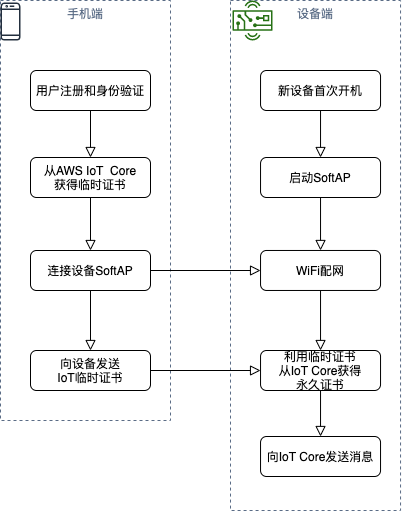
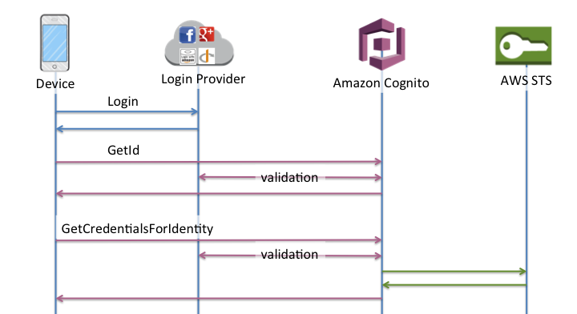
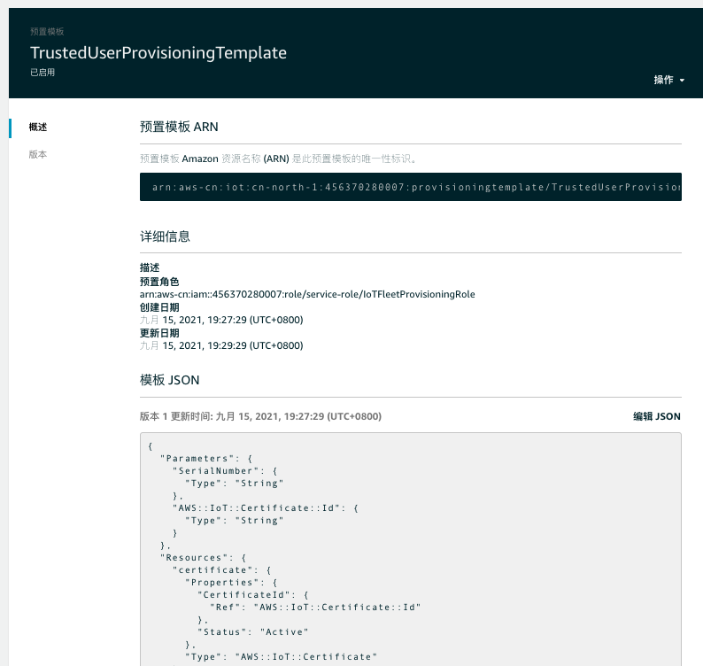

# AWS IoT基于可信用户的设备队列预置

## 需求背景和流程介绍

当最终用户需要高度的安全性时，当制造商和供应链不被信任时，或者由于技术限制、成本或应用的具体限制，不可能在制造端或者供应链中预置设备时，建议采用 "可信用户的队列预置"方案。使用这个方案，设备的连接凭证永远不会暴露在制造端和供应链环节中。

AWS IoT Core提供了可信用户队列预置的API接口，本方案补充提供了端到端的完整的方案，方便客户快速实现可信用户批量预置。

本方案面向To C的智能设备提供商，如智能家居/可穿戴设备/智能汽车等场景，还适用于拥有智能工厂的最终商业客户和其他需要批量注册设备和网关的客户。

请阅读[这里](https://docs.aws.amazon.com/iot/latest/developerguide/provision-wo-cert.html)了解更多细节。AWS提供了几种不同的方式来配置设备并在上面安装证书，可以参看[白皮书](https://d1.awsstatic.com/whitepapers/device-manufacturing-provisioning.pdf)，得到了详细描述。

### 基本流程
- 用户使用他编写和拥有的手机应用，使用受信任的（认证的）用户登录，并与AWS进行认证，手机应用收到一个临时的X.509证书和私钥，有效期为5分钟。
- 新设备首次开机启动SoftAP，用户手机连接设备SoftAP，一方面手机应用给设备传递能够连接Internet的Wi-Fi设置信息，另一方面从手机应用将临时证书被传递给设备。
- 设备连接到AWS IoT，并将临时凭证换成由AWS CA签署的唯一X.509证书和私钥，同时设备在AWS IoT注册。
- 在这个工作流程中，AWS IoT资源包括设备名称、策略和证书都在AWS账户中设置。
以下为流程示意图：



关于临时证书和永久证书交换的详细流程参看如下示意图：


## 前提条件和准备
部署本方案，前提需要准备手机端用户的统一身份认证系统，手机端用户认证通常采用OpenID Connect等认证体系；另外AWS IoT云上资源如：IoT策略，预置模版，设备名称，类型和分组等都需要预先设定好。
### 用户认证系统
手机端应用的用户认证可以采用Amazon Cognito User Pool或者其他认证服务，在这里我们采用开源用户认证系统[Keycloak](https://www.keycloak.org/),在AWS云上自动化部署请参考[Keycloak-on-AWS](https://github.com/aws-samples/keycloak-on-aws)。

移动用户通过Keycloak认证登录后拿到Access Token，通过和Amazon Cognito Identity Pools集成，实现和AWS IAM的Web联合身份认证，获得AWS的服务访问凭证Access Key和Securt Key，过程示意图如下：



Keycloak和Amazon Cognito Identity Pools集成配置请参见[部署向导](https://github.com/aws-samples/keycloak-on-aws/blob/master/doc/DEPLOYMENT_GUIDE.md)最后一部分。
其中关键有一个关键步骤，确保创建的Amazon Cognito Identity Pool的‘经过身份验证的角色’，附加如下策略，该角色能够通过IoT预置模版申请临时证书。
```
{
    "Effect": "Allow",
    "Action": [
        "iot:CreateProvisioningClaim",
    ],
    "Resource": [
        "arn:aws:us-east-1:account:provisioningtemplate/TrustedUserProvisioningTemplate"
    ]
}
```

### AWS IoT策略
IoT策略包括允许设备连接到AWS物联网核心消息代理，发送和接收MQTT消息，以及获取或更新设备的影子的操作。策略被附加到一个定义设备身份的证书上。当设备连接时，AWS IoT使用证书来查找附加的策略和它所持有的授权规则。

预置配置工作流程需要两套证书和对应的IoT策略。

第一个是临时证书和策略，该证书用于启动配置工作流程,IoT策略系统内置，用户无需设定。

第二个永久证书，我们需要手动创建永久证书的IoT策略，这个策略被配置模板引用，并在工作流过程中附加到永久证书上。下面的策略允许设备连接、发布和订阅MQTT消息。

创建新的IoT策略，将其命名为 "pubsub"，并为该策略设置以下内容。用你的账户ID替换'account'。
```
{
  "Version": "2012-10-17",
  "Statement": [
    {
      "Effect": "Allow",
      "Action": [
        "iot:Publish",
        "iot:Receive"
      ],
      "Resource": [
        "arn:aws-cn:iot:cn-north-1:account:topic/test/topic*"
      ]
    },
    {
      "Effect": "Allow",
      "Action": [
        "iot:Subscribe"
      ],
      "Resource": [
        "arn:aws-cn:iot:cn-north-1:account:topicfilter/*"
      ]
    },
    {
      "Effect": "Allow",
      "Action": [
        "iot:Connect"
      ],
      "Resource": [
        "arn:aws-cn:iot:cn-north-1:account:client/test*"
      ]
    }
  ]
}
```
### AWS IoT队列的配置模板

预置模板是一个JSON文档，它使用参数来描述你的设备必须使用的资源，以与AWS IoT互动。在配置队列预置模板时，你可以选择预配置钩子（Pre Provisioning Hook）。Pre Provisioning Hook是一个Lambda函数，用于在允许设备被配置之前验证从设备传递的参数。为了简单起见，我们将不使用Pre Provisioning Hook。

在AWS IoT控制台，导航到 "Onboard"，"Fleet provisioning templates"。
点击'创建模板',点击'开始':


模板名称：TrustedUserProvisioningTemplate
在'供应角色'下点击'创建角色'，并命名为'IoTFleetProvisioningRole',勾选‘使用Amazon IoT注册表来管理您的设备队列’,


点击'下一步'。
选择'使用现有的AWS IoT策略'并选择之前创建的'pubsub'。
点击'创建模板'。


填写物品名称前缀：‘mything_’, 可选选择物品类型以及组，点击‘创建模版’，


保持此页面默认设置，


点击页面底部的'启用模板'，


导航到‘队列预置模版’，选择创建的模板‘TrustedUserProvisioningTemplate’，可以看到模版JSON的内容，可以根据需求点击'Edit JSON'，修改模版。



如果用命令行执行如下：
```
aws iot create-provisioning-template \
        --template-name TrustedUserProvisioningTemplate \
        --provisioning-role-arn arn:aws-cn:iam::account:role/service-role/IoTFleetProvisioningRole \
        --template-body file://template.json \
        --enabled 
```
## 手机端应用执行步骤

### 手机端应用获得临时证书
用户在手机端通过身份认证系统注册并且登录，利用身份认证系统和AWS IAM联合身份认证，最终获取IoT临时证书，准备发送给设备端。
本项目手机端应用采用Python语言开发，需要Python3运行环境和相关依赖包。

安装python依赖模块
```
$ pip install requests==2.25.1 
$ pip install urllib3==1.26.5 
$ pip install python-keycloak
```
执行手机端应用程序
```
$ git clone https://github.com/comdaze/aws-iot-fleet-provisioning-trust-user.git
$ cd aws-iot-fleet-provisioning-trust-user
$ python mobile_claim.py
```
证书保存在./certs目录下，准备将私有密钥和证书发送到设备端。

### 手机端连接设备SoftAP对设备WiFi配网和发送临时证书

打开手机无线局域网设置，可以看到本项目采用树莓派设备初始化后建立的“RaspiWiFi Setup”热点：


查看热点路由器的IP地址：


打开手机浏览器输入：http://10.0.0.1， 可以看到“Upload Temparary Certificate File”，点击选取文件，选择刚刚获得临时证书文件，进行上传到树莓派设备。


还可以看到WiFi Setup设置界面


选择可以连接Internet的WiFi热点：


输入密码，点击提交，此时已经给树莓派设置好了WiFi，树莓派会自动重启


此时看到树莓派已经连接了刚才设置好的可以连接internet的WiFi热点.

## 设备端应用执行步骤
### 设备端WiFi配网
首先了解下WiFi配网，流程示意图如下：


本项目采用树莓派Raspberry Pi 3B+,利用RaspiWiFi程序，实现SoftAP和WiFi设定，首先进行RaspiWiFi初始化安装
```
$ git clone https://github.com/comdaze/aws-iot-fleet-provisioning-trust-user.git
$ cd aws-iot-fleet-provisioning-trust-user/RaspiWiFi
$ sudo python3 initial_setup.py


###################################
##### RaspiWiFi Intial Setup  #####
###################################


Would you like to specify an SSID you'd like to use 
for Host/Configuration mode? [default: RaspiWiFi Setup]: 


Would you like WPA encryption enabled on the hotspot 
while in Configuration Mode? [y/N]:y

What password would you like to for WPA hotspot 
access (if enabled above, 
Must be at least 8 characters) [default: NO PASSWORD]:0123456789

Would you like to enable 
auto-reconfiguration mode [y/N]?: y

How long of a delay would you like without an active connection 
before auto-reconfiguration triggers (seconds)? [default: 300]: 

Which port would you like to use for the Configuration Page? [default: 80]: 

Would you like to enable SSL during configuration mode 
(NOTICE: you will get a certificate ID error 
when connecting, but traffic will be encrypted) [y/N]?: N


Are you ready to commit changes to the system? [y/N]: y

Hit:1 http://archive.raspberrypi.org/debian buster InRelease
Hit:2 http://raspbian.raspberrypi.org/raspbian buster InRelease
Reading package lists... Done
Building dependency tree       
Reading state information... 0%

Installing Flask web server...

#####################################
##### RaspiWiFi Setup Complete  #####
#####################################


Initial setup is complete. A reboot is required to start in WiFi configuration mode...
Would you like to do that now? [y/N]: y

```
此时树莓派设备自动重启，重启后SoftAP建立，等待手机端连接和接收临时证书。

### 设备端获取永久证书
设备收到手机端传送的WiF设置信息，已经成功连接到互联网，同时设备端接收到手机端传送的临时证书，此时设备端可以执行如下程序向AWS IoT申请永久证书：  
```     
$ git clone https://github.com/comdaze/aws-iot-fleet-provisioning-trust-user.git
$ cd aws-iot-fleet-provisioning-trust-user
$ python3 device_fleet_provisioning.py \
        --endpoint a2jtec7plm36gl.ats.iot.cn-north-1.amazonaws.com.cn \
        --root-ca ./certs/root.ca.pem \
        --cert ./certs/provision.cert.pem \
        --key ./certs/provision.private.key \
        --templateName TrustedUserProvisioningTemplate \
        --templateParameters "{\"SerialNumber\":\"1\",\"DeviceLocation\":\"Beijing\"}"
``` 
验证设备端采用上一步申请的永久证书，向IoT Core发送消息，并订阅消息。
``` 
$ python3 pubsub.py --endpoint a2jtec7plm36gl.ats.iot.cn-north-1.amazonaws.com.cn --root-ca ./certs/root.ca.pem --key  ./certs/long-term.private.key --cert ./certs/long-term.cert.pem --topic test/topic

Connecting to a2jtec7plm36gl.ats.iot.cn-north-1.amazonaws.com.cn with client ID 'test-43340e64-4ddf-4331-a09b-37fe844353c7'...
Connected!
Subscribing to topic 'test/topic'...
Subscribed with QoS.AT_LEAST_ONCE
Sending 10 message(s)
Publishing message to topic 'test/topic': Hello World! [1]
Received message from topic 'test/topic': b'"Hello World! [1]"'
Publishing message to topic 'test/topic': Hello World! [2]
Received message from topic 'test/topic': b'"Hello World! [2]"'
Publishing message to topic 'test/topic': Hello World! [3]
Received message from topic 'test/topic': b'"Hello World! [3]"'
Publishing message to topic 'test/topic': Hello World! [4]
Received message from topic 'test/topic': b'"Hello World! [4]"'
Publishing message to topic 'test/topic': Hello World! [5]
Received message from topic 'test/topic': b'"Hello World! [5]"'
Publishing message to topic 'test/topic': Hello World! [6]
Received message from topic 'test/topic': b'"Hello World! [6]"'
Publishing message to topic 'test/topic': Hello World! [7]
Received message from topic 'test/topic': b'"Hello World! [7]"'
Publishing message to topic 'test/topic': Hello World! [8]
Received message from topic 'test/topic': b'"Hello World! [8]"'
Publishing message to topic 'test/topic': Hello World! [9]
Received message from topic 'test/topic': b'"Hello World! [9]"'
Publishing message to topic 'test/topic': Hello World! [10]
Received message from topic 'test/topic': b'"Hello World! [10]"'
10 message(s) received.
Disconnecting...
Disconnected!

```

程序详细运行流程可以参考[notebook](/notebook/fleet_provisioning.ipynb)。