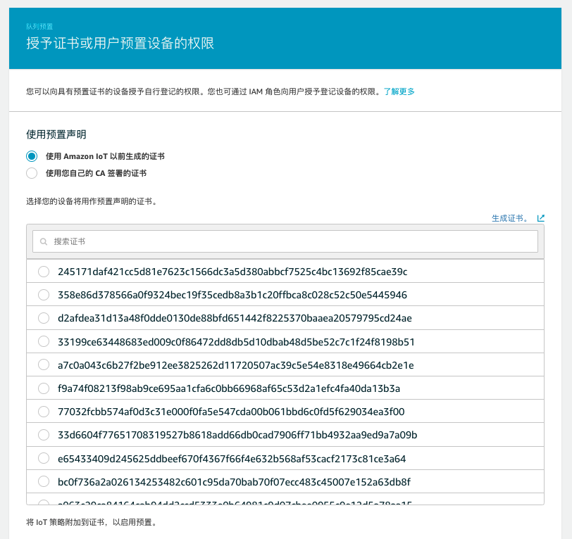

# aws-iot-fleet-provisioning-trust-user
## WiFi 配网
```
$ cd RaspiWiFi
$ sudo python3 initial_setup.py


###################################
##### RaspiWiFi Intial Setup  #####
###################################


Would you like to specify an SSID you'd like to use 
for Host/Configuration mode? [default: RaspiWiFi Setup]: 


Would you like WPA encryption enabled on the hotspot 
while in Configuration Mode? [y/N]:y

What password would you like to for WPA hotspot 
access (if enabled above, 
Must be at least 8 characters) [default: NO PASSWORD]:0123456789

Would you like to enable 
auto-reconfiguration mode [y/N]?: y

How long of a delay would you like without an active connection 
before auto-reconfiguration triggers (seconds)? [default: 300]: 

Which port would you like to use for the Configuration Page? [default: 80]: 

Would you like to enable SSL during configuration mode 
(NOTICE: you will get a certificate ID error 
when connecting, but traffic will be encrypted) [y/N]?: N


Are you ready to commit changes to the system? [y/N]: y

Hit:1 http://archive.raspberrypi.org/debian buster InRelease
Hit:2 http://raspbian.raspberrypi.org/raspbian buster InRelease
Reading package lists... Done
Building dependency tree       
Reading state information... 0%

Installing Flask web server...

#####################################
##### RaspiWiFi Setup Complete  #####
#####################################


Initial setup is complete. A reboot is required to start in WiFi configuration mode...
Would you like to do that now? [y/N]: y

```
此时机器自动重启

打开手机无线局域网设置，可以看到“RaspiWiFi Setup”热点：


查看热点路由器的IP地址：


打开手机浏览器输入：http://10.0.0.1 ,可以看到WiFi Setup设置界面


选择可以连接Internet的WiFi热点：


输入密码，点击提交，此时已经给树莓派设置好了WiFi，树莓派会自动重启


此时看到树莓派已经连接了刚才设置好的可以连接internet的WiFi热点

## 基于可信用户的IoT设备注册
AWS提供了几种不同的方式来配置设备并在上面安装独特的客户证书。AWS还提供了一个互动工具来帮助指导你的决定。这些选项在题为《AWS物联网核心中使用X.509证书的设备制造和供应》的白皮书中得到了详细描述。

本次研讨会重点讨论 "由受信任的用户提供车队 "这一选项。当需要高度的安全性时，当制造链不被信任时，或者由于技术限制、成本或应用的具体限制，不可能在制造链中配置设备时，建议采用 "受信任用户的车队配置 "的方式。使用这种方法，凭证永远不会暴露在制造供应链中。请阅读这里了解更多细节。
### 基本流程
安装者使用他编写和拥有的移动/网络应用，并与AWS进行认证。使用受信任的（认证的）用户API，安装者收到一个临时的X.509证书和私钥，有效期为5分钟。使用移动/网络应用，证书被传递给设备。设备连接到AWS IoT，并将临时凭证换成由AWS CA签署的唯一X.509证书和私钥。在这个工作流程中，AWS资源包括Thing名称、策略和证书都在AWS账户中设置。


### AWS IoT策略
IoT策略包括允许设备连接到AWS物联网核心消息代理，发送和接收MQTT消息，以及获取或更新设备的影子的操作。策略被附加到一个定义设备身份的证书上。当设备连接时，AWS IoT使用证书来查找附加的策略和它所持有的授权规则。

预制配置工作流程需要两个IoT策略。

第一个物联网策略由AWS物联网附加到临时证书上，因此设备可以启动配置工作流程。
第二个策略是附加到设备中的永久证书上。
让我们创建第一个物联网策略，将其附加到临时证书上。

在物联网核心服务控制台，导航到 "安全"，然后是 "策略"。
点击 "创建策略"。
设置名称。'TrustedUserProvisioningPolicy'。
点击'添加语句'部分下的'高级模式'，并将政策内容替换为以下内容。你用你的账户ID替换'account'。
完成后，点击'创建'。
```
{
  "Version": "2012-10-17",
  "Statement": [
    {
      "Effect": "Allow",
      "Action": [
        "iot:Publish"
      ],
      "Resource": [
        "arn:aws:iot:us-east-1:account:topic/$aws/certificates/create/json",
        "arn:aws:iot:us-east-1:account:topic/$aws/provisioning-templates/TrustedUserProvisioningTemplate/provision/json"
      ]
    },
    {
      "Effect": "Allow",
      "Action": [
        "iot:Receive",
        "iot:Subscribe"
      ],
      "Resource": [
        "arn:aws:iot:us-east-1:account:topic/$aws/certificates/create/json/accepted",
        "arn:aws:iot:us-east-1:account:topic/$aws/certificates/create/json/rejected",
        "arn:aws:iot:us-east-1:account:topic/$aws/provisioning-templates/TrustedUserProvisioningTemplate/provision/json/accepted",
        "arn:aws:iot:us-east-1:account:topic/$aws/provisioning-templates/TrustedUserProvisioningTemplate/provision/json/rejected"
      ]
    },
    {
      "Effect": "Allow",
      "Action": "iot:Connect",
      "Resource": "arn:aws:iot:us-east-1:account:client/${iot:Connection.Thing.ThingName}"
    }
  ]
}
```
接下来，我们需要创建第二个物联网策略，它将被附加到配置到设备的永久证书上。这个策略被配置模板引用，并在工作流过程中附加到永久证书上。下面的策略允许设备连接、发布和订阅MQTT消息，这些消息的前缀是事物名称（MQTT客户端ID和AWS IoT核心中注册的事物名称）。

创建新的物联网策略，将其命名为 "pubsub"，并为该策略设置以下内容。你将不得不用你的账户ID替换'账户'。
```
{
  "Version": "2012-10-17",
  "Statement": [
    {
      "Effect": "Allow",
      "Action": [
        "iot:Publish",
        "iot:Receive"
      ],
      "Resource": [
        "arn:aws:iot:us-east-1:account:topic/${iot:Connection.Thing.ThingName}/*"
      ]
    },
    {
      "Effect": "Allow",
      "Action": [
        "iot:Subscribe"
      ],
      "Resource": [
        "arn:aws:iot:us-east-1:account:topicfilter/$aws/things/${iot:Connection.Thing.ThingName}/*"
      ]
    },
    {
      "Effect": "Allow",
      "Action": [
        "iot:Connect"
      ],
      "Resource": [
        "arn:aws:iot:us-east-1:account:client/${iot:Connection.Thing.ThingName}"
      ]
    }
  ]
}
```
### AWS IoT队列的配置模板
预置模板是一个JSON文档，它使用参数来描述你的设备必须使用的资源，以与AWS IoT互动。在配置车队供应模板时，你可以选择配置预供应钩子。预配置Hook是一个Lambda函数，用于在允许设备被配置之前验证从设备传递的参数。为了简单起见，我们将不使用Pre Provisioning Hook。

在AWS IoT控制台，导航到 "Onboard"，"Fleet provisioning templates"。
点击'创建模板',点击'开始':

模板名称：TrustedUserProvisioningTemplate
在'供应角色'下点击'创建角色'，并命名为'IoTFleetProvisioningRole'

点击'下一步'。
选择'使用现有的AWS IoT策略'并选择之前创建的'TrustedUserProvisioningPolicy'。
点击'创建模板'。

保持此页面默认设置，点击页面底部的'启用模板'。


导航到'Fleet provisioning templates'，选择创建的模板并点击'Edit JSON'。
用下面的内容替换模板的内容，并点击'保存为新版本'。
```
{
  "Parameters": {
    "DeviceLocation": {
      "Type": "String"
    },
    "AWS::IoT::Certificate::Id": {
      "Type": "String"
    },
    "SerialNumber": {
      "Type": "String"
    }
  },
  "Mappings": {
    "LocationTable": {
      "Seattle": {
        "LocationUrl": "https://example.aws"
      }
    }
  },
  "Resources": {
    "thing": {
      "Type": "AWS::IoT::Thing",
      "Properties": {
        "ThingName": {
          "Fn::Join": [
            "",
            [
              "ThingPrefix_",
              {
                "Ref": "SerialNumber"
              }
            ]
          ]
        },
        "AttributePayload": {
          "version": "v1",
          "serialNumber": "serialNumber"
        }
      },
      "OverrideSettings": {
        "AttributePayload": "MERGE",
        "ThingTypeName": "REPLACE",
        "ThingGroups": "DO_NOTHING"
      }
    },
    "certificate": {
      "Type": "AWS::IoT::Certificate",
      "Properties": {
        "CertificateId": {
          "Ref": "AWS::IoT::Certificate::Id"
        },
        "Status": "Active"
      },
      "OverrideSettings": {
        "Status": "REPLACE"
      }
    },
    "policy": {
      "Type": "AWS::IoT::Policy",
      "Properties": {
        "PolicyDocument": {
          "Version": "2012-10-17",
          "Statement": [
            {
              "Effect": "Allow",
              "Action": [
                "iot:Connect",
                "iot:Subscribe",
                "iot:Publish",
                "iot:Receive"
              ],
              "Resource": "*"
            }
          ]
        }
      }
    }
  },
  "DeviceConfiguration": {
    "FallbackUrl": "https://www.example.com/test-site",
    "LocationUrl": {
      "Fn::FindInMap": [
        "LocationTable",
        {
          "Ref": "DeviceLocation"
        },
        "LocationUrl"
      ]
    }
  }
}

```
如果用命令行执行如下：
```
aws iot create-provisioning-template \
        --template-name TrustedUserProvisioningTemplate \
        --provisioning-role-arn arn:aws-cn:iam::456370280007:role/service-role/IoTFleetProvisioningRole \
        --template-body file://template.json \
        --enabled 
```

aws iot create-provisioning-claim \
        --template-name TrustedUserProvisioningTemplate \
        | python3 ./utils/parse_cert_set_result.py \
        --path ./certs \
        --filename provision
        
python3 fleetprovisioning.py \
        --endpoint a2jtec7plm36gl.ats.iot.cn-north-1.amazonaws.com.cn \
        --root-ca ./certs/root.ca.pem \
        --cert ./certs/provision.cert.pem \
        --key ./certs/provision.private.key \
        --templateName TrustedUserProvisioningTemplate \
        --templateParameters "{\"SerialNumber\":\"1\",\"DeviceLocation\":\"Seattle\"}"